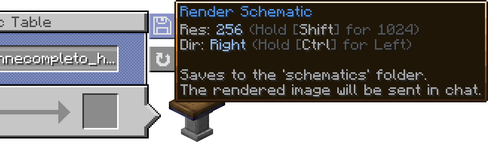

# Create: Blueprinted

Originally made for the [Brassworks SMP](https://brassworks.opnsoc.org/), this mod is free and open for anyone to use!

Create: Blueprinted allows you to render your Create mod schematics into high-resolution PNG images straight from the game.
___
## Features
* **High-Resolution Renders:** Render your `.nbt` schematics to crisp PNGs directly from the Schematic Table UI or a command.
* **Multiple Views & Angles:** Pick a named view — isometric (left/right), front, back, left, right, top, or bottom — or dial in any custom camera angle.
* **Adjustable Resolution:** Choose your output width, from a quick preview all the way up to 8192px posters.
* **Anti-Aliasing:** Built-in supersampling smooths out jagged edges. It's on by default, and you can tune or disable it.
* **Fluids Included:** Water, lava, and waterlogged blocks are drawn in the render instead of being skipped.
* **Background Rendering:** Renders run in the background without freezing the game, with a live progress bar in your action bar.
* **UI Bug Fix:** Fixes a bug in the Create Schematic Table screen where long schematic names can overflow out of the textbox bounds.
___
## Usage
### In-Game UI
You can render schematics directly from the Schematic Table. Just select your schematic and click the new render button!

Hold **Shift** while clicking to render at 2048px (instead of the default 1024px), and **Ctrl** to use the left isometric view.



- *Rendered Build by [LiukRast](https://liukrast.net/)*

### Commands
If you need more control over the output, you can use the built-in command:
```bash
/renderschem <filename> [view] [width] [antialiasing]
```
* **view** — a named view: `isometric_right` (or `right`), `isometric_left` (or `left`), `front`, `back`, `left`, `right`, `top`, `bottom`.
* **width** — total output width in pixels (64–8192).
* **antialiasing** — supersampling factor: `1` = off, `2`–`4` = progressively smoother edges (defaults to `2`).

Want a fully custom camera angle? Use:
```bash
/renderschem <filename> angle <yaw> <pitch> [roll] [width] [antialiasing]
```
